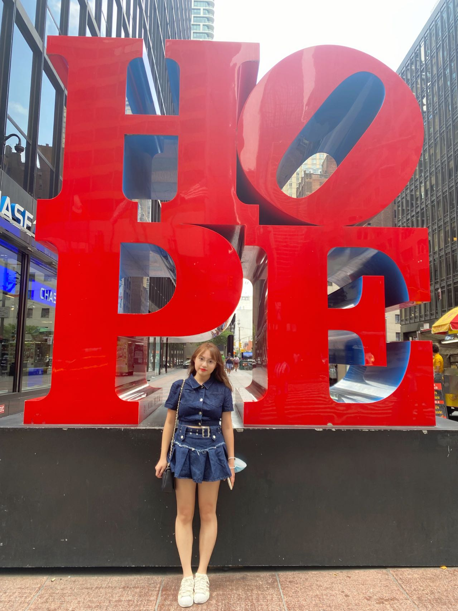

## Amy Ma

1st-year MS student in Biostatistics from Columbia University | Actively Seeking 23 Summer Internships

Hi! This is **Jiong(Amy) Ma's** amazing website. By exploring it you can get a brief knowledge of me, and It is such a pleasure to have you here. :)

## Brief Introduction

I come from China, and I am now pursuing my graduate study in Columbia University. I used to study biological science, but I am a **biostatistics student** now. My career goal is to be a data scientist or biostatistician in the pharmaceutical industry, and dedicated to addressing real-word public health problems.

I can program in **R/Python/SAS/MATLAB**, and I have some basic skills of **SQL**.
I am also actively seeking 2023' Summer internships as **data scientist/biostatistician/statistical programmer/computational biologist** or **any other jobs alike**.

Here are the links to my [resume](cv.html) and [LinkedIn](https://cn.linkedin.com/in/jiong-m-6818b8218?trk=people-guest_people_search-card).

